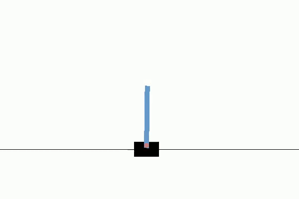
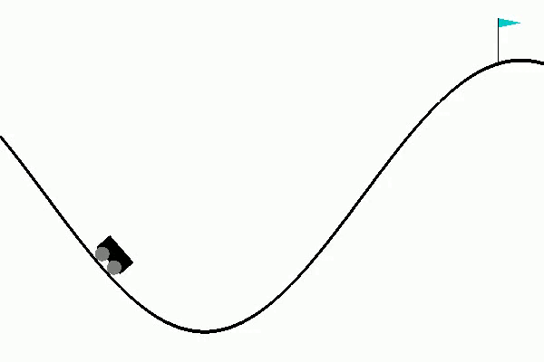
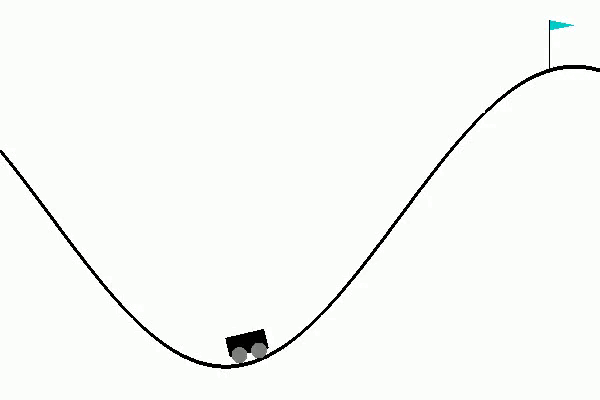

# Neural Pontryagin maximum principle (NeuralPMP)
Pontryagin maximum principle-based learning framework for optimal control problems with variational auto-encoder-like network architecture.

* Cartpole:

Untrained                  |  NeuralPMP
:-------------------------:|:-------------------------:
  |  

 

* Mountain car:

Untrained                  |  NeuralPMP
:-------------------------:|:-------------------------:
  |  