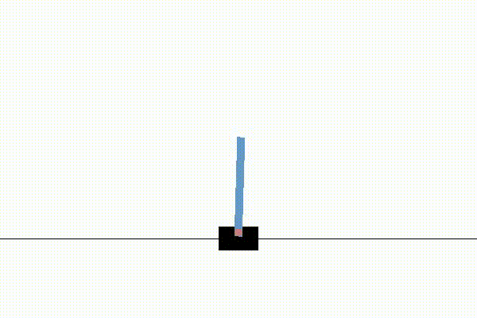

# Neural Pontryagin maximum principle
Pontryagin maximum principle based neural ODE net for handling optimal control problem with time-series data in both finite and infinite dimensional settings

A few examples in finite-dimensional setting:

* Cartpole:

* Mountain car:

Infinite-dimensional case:
* 2D density map:

